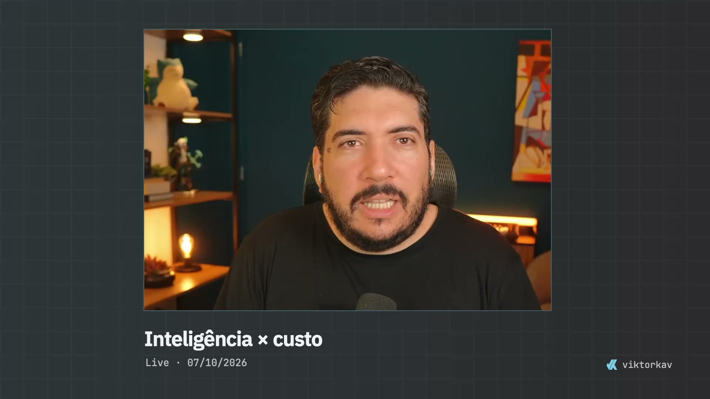

# H2 — Custo por tarefa

Corte da [live do ViktorKav de 7/10/2026](https://youtu.be/Vl6io32bFLE), montado e exportado pelo DaVinci Resolve. 291,6 s,8.748 frames,1920×1080,30fps. Nove apoios Remotion de 15 s; intervalo máximo de 40 s entre os inícios.

- [Vídeo MP4](https://github.com/viktorkav/gpt-6-1-sol-semana/releases/download/entregas-2026-10-08/H2-custo-por-tarefa-entrega1.mp4)
- [Projeto Resolve e composições Remotion editáveis](https://github.com/viktorkav/gpt-6-1-sol-semana/releases/download/entregas-2026-10-08/H2-projeto-editavel.zip)

O bundle contém DRP/DRT originais, fontes Remotion portáveis, marca/fontes locais e os mapas da montagem. DRP/DRT não embutem mídia; a live integral e os renders intermediários não estão no bundle. Os arquivos exigem recuperação da fonte, regeneração dos grafismos quando necessário e relink no Resolve. Instruções completas dentro do ZIP.

Primeira entrega editorial; os sites e o jogo receberam uma revisão, os vídeos ainda conservam uma revisão futura. A conferência técnica passou, sem escuta contínua confirmada nesta sessão.

Os prompts e a avaliação humana estão no [artigo da Régua](https://viktorkav.com.br/regua/exploracoes/gpt-6-1-sol-semana), exclusiva para membros. [Direitos e fontes](../../DIREITOS-E-FONTES.md).
